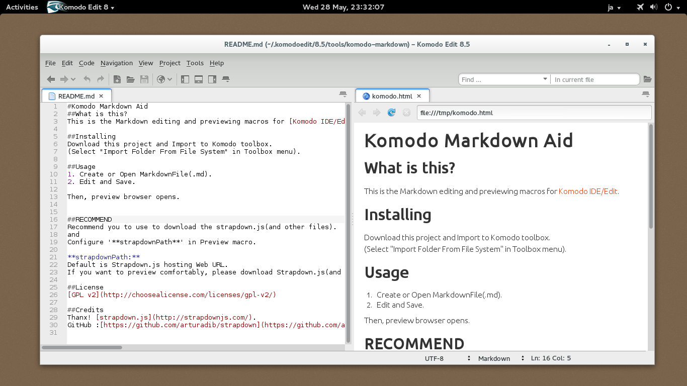

#Komodo Markdown Aid
##What is this?
This is the Markdown editing and previewing macros for [Komodo IDE/Edit](http://komodoide.com/).

##Installing
Download this project and Import to Komodo toolbox.  
(Select "Import Folder From File System" in Toolbox menu).

##Usage
1. Create or Open MarkdownFile(.md).
2. Edit and Save.

Then, preview browser opens.

##License
This software is released under the MIT License, see LICENSE.txt.

##Credits
Thanx! [strapdown.js](http://strapdownjs.com/).  
GitHub :[https://github.com/arturadib/strapdown](https://github.com/arturadib/strapdown)
